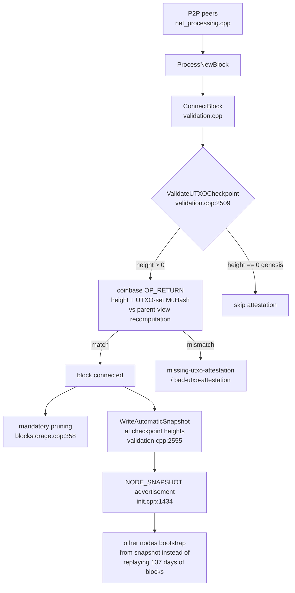

# Architecture Decision Records — Elektron Net

Architecture Decision Records (ADRs) for the fork-specific subsystems of
Elektron Net. Each record documents one architecture decision or one open
design question, with its context, the options considered, and the
consequences. Code references are anchored to `file:line` so every claim
can be re-verified against the tree.

## Format

Each ADR contains:

- **Status** — `Accepted` (documents the behavior already in the tree) or
  `Proposed` (open design question; no decision has been made yet).
- **Context** — why the question exists, with evidence (`file:line`).
- **Decision / Options** — what the tree does today, or the options
  considered for an open question with trade-offs.
- **Consequences** — what follows from the decision.
- **Mermaid diagrams** where the flow is easier to read as a picture.

## Index

| ADR | Title | Status | Origin |
|---|---|---|---|
| [0001](adr-0001-snapshot-bootstrap.md) | UTXO snapshot bootstrap path | Accepted | architecture scan |
| [0002](adr-0002-utxo-attestation-gate.md) | Per-block UTXO attestation gate | Accepted | architecture scan |
| [0003](adr-0003-mandatory-prune-model.md) | Mandatory height-based pruning model | Accepted | architecture scan |
| [0004](adr-0004-prune-target-vestigial.md) | Vestigial prune-target machinery in `FindFilesToPrune` | Proposed | design question I1 |
| [0005](adr-0005-snapshot-source-selection.md) | Snapshot source selection: first responder wins | Proposed | design question I2 |
| [0006](adr-0006-sidecar-trust-model.md) | Trust model of the downloaded `.hash` sidecar | Proposed | design question I3 |
| [0007](adr-0007-conflicted-coinbase-invariant.md) | Conflicted-coinbase assert in wallet maturity accounting | Proposed | design question I4 |
| [0008](adr-0008-miner-polling-model.md) | Work-update model of `mining/miner.py` | Proposed | design question I5 |
| [0009](adr-0009-utxostats-kernelization.md) | Decoupling `ComputeUTXOStats` from `node::BlockManager` | Proposed | PR #50 follow-up |

## Overall architecture (fork-specific path)

The three accepted ADRs 0001–0003 describe these subsystems in detail.
The six proposed records are tracked upstream as design issues
[#57](https://github.com/kutlusoy/elektron-net/issues/57)–[#62](https://github.com/kutlusoy/elektron-net/issues/62).