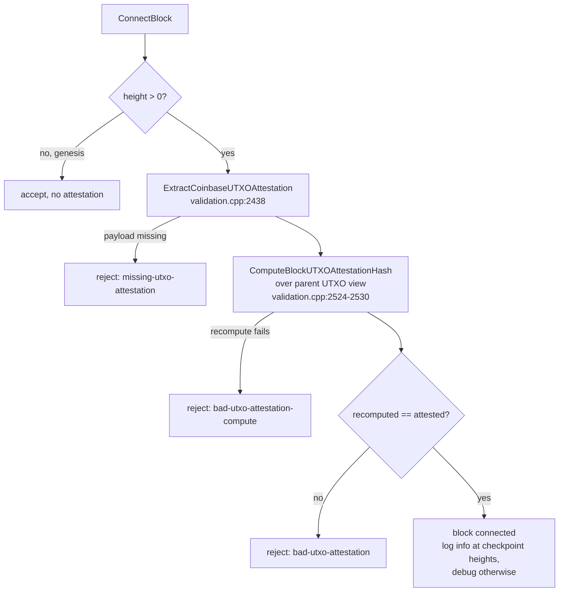

# ADR-0002: Per-block UTXO attestation gate

**Status:** Accepted — documents consensus behavior present in the tree as
of upstream `main` (`447c069`).

## Context

Elektron Net must let nodes — including snapshot-bootstrapped nodes that
never saw the full block history — verify that the UTXO set a block was
mined against matches the UTXO set that block actually produces. The fork
achieves this by carrying a compact UTXO-set commitment in every block's
coinbase instead of trusting the miner.

## Decision

**Every block with `height > 0` must carry a coinbase `OP_RETURN`
attestation** containing the UTXO-set MuHash computed after connecting
the block. Genesis is exempt (`src/validation.cpp:2512-2514`).

Semantics, as implemented in `ValidateUTXOCheckpoint`
(`src/validation.cpp:2509-2549`, called from `ConnectBlock`):

1. The coinbase must contain an `OP_RETURN` output; a well-formed payload
   is extracted by `ExtractCoinbaseUTXOAttestation`
   (`src/validation.cpp:2438`). Missing payload ⇒
   `missing-utxo-attestation`.
2. The expected hash is **recomputed from the parent UTXO view** — the
   backend of the connect-time cache, not the post-connect cache — by
   `ComputeBlockUTXOAttestationHash` (`src/validation.cpp:2524-2530`).
   This matters for miners: *the attestation is computed before the
   `OP_RETURN` is added to the coinbase* (same comment at
   `src/validation.cpp:2525`; the miner assembles the payload in
   `src/node/miner.cpp:204-226`). This ordering is also the root cause of
   the snapshot sidecar anchoring gap described in
   [ADR-0006](adr-0006-sidecar-trust-model.md).
3. Mismatch ⇒ `bad-utxo-attestation` (or `bad-utxo-attestation-compute`
   when the recomputation itself fails). A match logs at info level on
   checkpoint heights (`height % MandatoryPruneDepth == 0`) and at debug
   level otherwise (`src/validation.cpp:2541-2547`).

"Checkpoint" is a snapshot/persistence concept, not an attestation
frequency concept: the gate runs on **every** block; full snapshot files
are only written every `MANDATORY_PRUNE_DEPTH` blocks
(`src/validation.cpp:2506-2507`, `src/node/miner.cpp:205`).

The activation height of MuHash attestation is
`MuhashAttestationActivationHeight = 137000`
(`src/kernel/chainparams.cpp:117/126/157`).

## Consequences

- Every block binds itself to the UTXO state it transitions from, making
  an invalid UTXO transition undetectable-by-reorg impossible without
  consensus rejection.
- Pools integrating via `getblocktemplate` must emit
  `coinbase_required_outputs` (the attestation `OP_RETURN`) verbatim —
  documented in `doc-elektron/mining-pool-integration.md` and
  upstream PR #49.
- The attestation hash is keyed to a coinbase that does not yet contain
  the attestation itself; the implications for on-chain anchoring of
  snapshots are tracked in [ADR-0006](adr-0006-sidecar-trust-model.md).

## Gate flow

