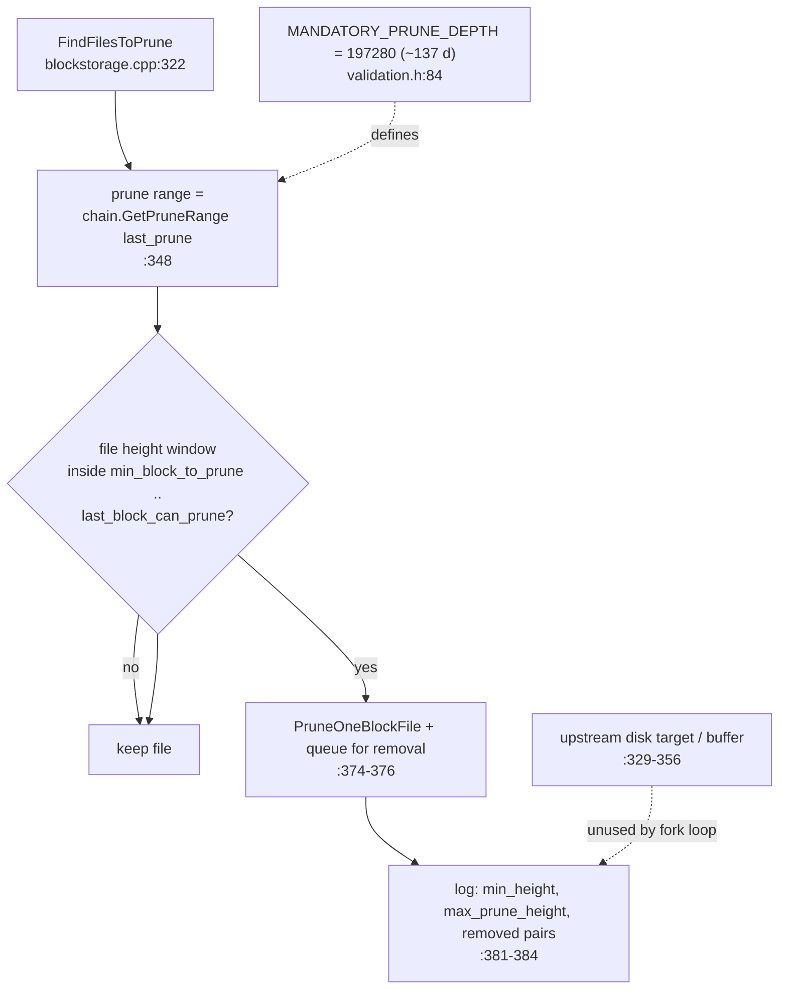

# ADR-0003: Mandatory height-based pruning model

**Status:** Accepted — documents pruning behavior present in the tree as
of upstream `main` (`447c069`). Related open design question:
[ADR-0004](adr-0004-prune-target-vestigial.md) (vestigial prune-target
machinery).

## Context

The attestation gate ([ADR-0002](adr-0002-utxo-attestation-gate.md)) and
the snapshot bootstrap path ([ADR-0001](adr-0001-snapshot-bootstrap.md))
remove the need to retain arbitrary block history: any block older than
the snapshot horizon is reconstructable from snapshots plus the
attestation chain. The fork therefore replaces disk-size-driven pruning
with a fixed, height-based retention window.

## Decision

**Retention is governed exclusively by height, not by disk usage.**

- `MANDATORY_PRUNE_DEPTH = 197280` blocks ≈ 137 days at the 60 s block
  spacing (`src/validation.h:84`).
- The user-facing `-prune=<GB>` option is parsed but then discarded;
  retention is explicitly documented as not governed by disk size
  (`src/node/blockmanager_args.cpp:36-40`; also
  `src/qt/optionsmodel.cpp:354`, `src/qt/intro.cpp:110`).
- `nPruneAfterHeight` is set to the same 197280
  (`src/kernel/chainparams.cpp:181`), so the first mandatory prune
  coincides with the first snapshot checkpoint.
- In `BlockManager::FindFilesToPrune`
  (`src/node/blockstorage.cpp:322-385`) the effective prune range comes
  from `chain.GetPruneRange(last_prune)` (`:348`); the loop at `:358-379`
  marks every block file whose height range falls inside the mandatory
  window for deletion, *regardless of* the `target` disk-size budget the
  upstream code computes above it. `MIN_BLOCKS_TO_KEEP = 2880`
  (`src/validation.h:77`) bounds how long recent blocks stay.
- The checkpoint interval equals the prune depth
  (`src/validation.cpp:2555-2559`), so a snapshot for the oldest pruned
  horizon is always written before blocks leave the retention window.

## Consequences

- Storage usage is a predictable function of chain height and block
  size, not of user preference; nodes cannot opt out.
- The retention window is only safe in combination with automatic
  snapshots ([ADR-0001](adr-0001-snapshot-bootstrap.md)): a node that
  never obtained a snapshot has nothing to fall back on once blocks are
  pruned. This coupling is intentional but is the backdrop of the
  trust questions in [ADR-0005](adr-0005-snapshot-source-selection.md)
  and [ADR-0006](adr-0006-sidecar-trust-model.md).
- The upstream disk-target machinery inside `FindFilesToPrune` is
  vestigial in this fork; see
  [ADR-0004](adr-0004-prune-target-vestigial.md).

## Prune decision

